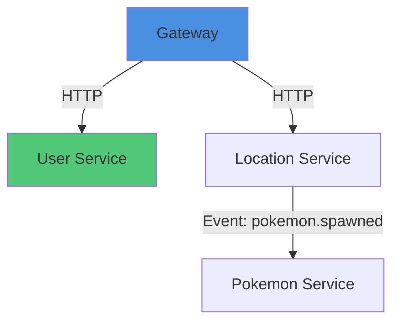

# REQ-00103：微服务依赖图与循环依赖检测系统

- **编号**：REQ-00103
- **类别**：技术债/重构
- **优先级**：P1
- **状态**：new
- **涉及服务/模块**：gateway、所有微服务、backend/shared、infrastructure/k8s、docs/architecture
- **创建时间**：2026-06-11 04:00
- **依赖需求**：无

## 1. 背景与问题

### 现状分析
mineGo 采用 9 个微服务架构（gateway/user/location/pokemon/catch/gym/social/reward/payment），服务间通过 HTTP 同步调用和 Kafka 异步事件进行通信。随着需求增长（已达 102 条），服务间依赖关系日趋复杂：

1. **缺乏全局依赖视图**：没有统一的依赖关系图，开发人员难以快速理解服务间调用链路
2. **循环依赖风险**：存在潜在的循环调用（如 user-service → social-service → user-service），可能导致级联故障
3. **故障传播路径不明确**：当某个服务异常时，无法快速判断影响范围
4. **服务启动顺序依赖**：没有明确的启动顺序文档，可能导致服务启动失败

### 代码证据
- gateway/src/index.js 中硬编码了 9 个服务 URL，但未记录依赖关系
- social-service/src/handlers/catchHandler.js 依赖 user-service，但无显式依赖声明
- 多个服务存在双向依赖风险（如 user ↔ social, pokemon ↔ catch）

### 影响
- 新人上手成本高：理解服务依赖需要逐个阅读代码
- 重构风险大：修改服务接口时可能破坏隐性依赖
- 故障排查困难：定位级联故障需要大量时间

## 2. 目标

1. **可视化依赖关系**：生成完整的服务依赖图（同步调用 + 异步事件）
2. **自动检测循环依赖**：在 CI/CD 阶段检测并告警循环依赖
3. **故障影响分析**：快速定位某个服务异常时的下游影响范围
4. **启动顺序优化**：生成最优化的服务启动顺序

**可量化目标**：
- 依赖关系准确率 ≥ 99%
- 循环依赖检测时间 < 5 秒
- 新人理解依赖关系时间从 2 小时降至 10 分钟

## 3. 范围

### 包含
- 静态代码分析：从代码中提取依赖关系（HTTP 调用、Kafka Topic）
- 依赖图生成：输出 GraphViz DOT 格式和 Mermaid 格式
- 循环依赖检测：使用拓扑排序算法检测循环
- CI/CD 集成：在 GitHub Actions 中自动运行依赖检查
- 文档生成：自动更新 ARCHITECTURE.md 中的依赖关系图
- API 端点：提供依赖查询接口（用于监控仪表板）

### 不包含
- 动态运行时依赖分析（如运行时服务发现）
- 数据库表依赖分析（属于数据库治理范畴）
- 第三方依赖分析（npm 包依赖）

## 4. 详细需求

### 4.1 依赖关系提取器

创建 `backend/shared/dependencyAnalyzer.js`，包含以下功能：

**静态代码分析规则**：
```javascript
// 1. HTTP 客户端调用
// 匹配: axios.get('http://user-service:8081/api/users')
// 匹配: fetch(`${process.env.USER_SERVICE_URL}/api/users`)

// 2. 事件总线订阅
// 匹配: eventBus.subscribe('user.created', handler)
// 匹配: eventBus.publish('pokemon.caught', data)

// 3. 服务代理配置
// 匹配: app.use('/api/users', proxy({ target: SERVICES.user }))
```

**依赖类型定义**：
- `sync_http`: 同步 HTTP 调用
- `async_event_pub`: 异步事件发布
- `async_event_sub`: 异步事件订阅

**输出格式**：
```javascript
{
  services: ['gateway', 'user-service', 'location-service', ...],
  dependencies: [
    { from: 'gateway', to: 'user-service', type: 'sync_http', count: 5 },
    { from: 'catch-service', to: 'user-service', type: 'async_event_pub', topic: 'pokemon.caught' },
  ],
  cycles: [
    ['user-service', 'social-service', 'user-service']
  ]
}
```

### 4.2 依赖图生成器

创建 `scripts/generate-dependency-graph.js`：

**输出格式**：
1. **GraphViz DOT**：用于生成高质量 PNG/SVG 图片
2. **Mermaid**：用于 Markdown 文档内嵌
3. **JSON**：用于 API 返回

**Mermaid 示例**：


### 4.3 循环依赖检测算法

使用 Kahn 拓扑排序算法：

```javascript
function detectCycles(dependencies) {
  // 1. 构建入度表
  const inDegree = new Map();
  
  // 2. 找到所有入度为 0 的节点
  const queue = services.filter(s => inDegree.get(s) === 0);
  
  // 3. 拓扑排序
  const sorted = [];
  while (queue.length > 0) {
    const node = queue.shift();
    sorted.push(node);
    
    for (const neighbor of getDependencies(node)) {
      inDegree.set(neighbor, inDegree.get(neighbor) - 1);
      if (inDegree.get(neighbor) === 0) {
        queue.push(neighbor);
      }
    }
  }
  
  // 4. 如果排序结果不等于所有服务，则存在环
  if (sorted.length < services.length) {
    return findCyclesDFS(dependencies);
  }
  
  return { hasCycle: false, startupOrder: sorted };
}
```

### 4.4 CI/CD 集成

创建 `.github/workflows/dependency-check.yml`：

```yaml
name: Dependency Check

on:
  push:
    paths: ['backend/**', '.github/workflows/dependency-check.yml']
  pull_request:
    paths: ['backend/**']

jobs:
  check-dependencies:
    runs-on: ubuntu-latest
    steps:
      - uses: actions/checkout@v4
      - uses: actions/setup-node@v4
        with:
          node-version: '20'
      
      - name: Install dependencies
        run: cd backend && npm install
      
      - name: Analyze dependencies
        run: |
          cd backend
          node scripts/analyze-dependencies.js > dependency-report.json
          
      - name: Check for cycles
        run: |
          cd backend
          node scripts/check-cycles.js --fail-on-cycle
      
      - name: Upload dependency graph
        uses: actions/upload-artifact@v4
        with:
          name: dependency-graph
          path: dependency-*.png
```

**告警规则**：
- 发现循环依赖时 CI 失败
- 发现新依赖时输出警告（需人工确认）
- 依赖删除时输出提示（可能影响其他服务）

### 4.5 API 端点

创建 `backend/gateway/src/routes/dependencies.js`：

**端点设计**：
```
GET  /api/admin/dependencies              # 获取完整依赖图
GET  /api/admin/dependencies/:service     # 获取单个服务的依赖
GET  /api/admin/dependencies/cycles       # 检测循环依赖
GET  /api/admin/dependencies/startup-order # 获取启动顺序
GET  /api/admin/dependencies/graph        # 获取 Mermaid 格式依赖图
GET  /api/admin/dependencies/impact/:service # 分析服务故障影响范围
```

**响应示例**：
```json
{
  "service": "user-service",
  "dependencies": {
    "upstream": ["gateway"],
    "downstream": ["social-service", "reward-service"],
    "events_subscribed": ["pokemon.caught", "gym.battle.ended"],
    "events_published": ["user.created", "user.levelup"]
  },
  "health_score": 95,
  "last_analyzed": "2026-06-11T04:00:00Z"
}
```

### 4.6 文档自动更新

在 `scripts/update-dependency-docs.js` 中：

1. 更新 `ARCHITECTURE.md` 的依赖关系图章节
2. 生成 `docs/architecture/dependency-graph.png`
3. 创建 `docs/architecture/service-startup-order.md`

### 4.7 Prometheus 指标

在 `backend/shared/metrics.js` 中新增：

```javascript
// 依赖分析指标
const dependencyCount = new Gauge({
  name: 'minego_service_dependency_count',
  help: 'Number of dependencies per service',
  labelNames: ['service', 'type']
});

const cycleDetected = new Gauge({
  name: 'minego_dependency_cycle_detected',
  help: 'Number of cycles detected in dependency graph'
});

const dependencyHealthScore = new Gauge({
  name: 'minego_dependency_health_score',
  help: 'Dependency health score (0-100)',
  labelNames: ['service']
});
```

## 5. 验收标准（可测试）

- [ ] 能够准确识别 9 个微服务之间的所有 HTTP 调用依赖（通过单元测试验证）
- [ ] 能够准确识别所有 Kafka Topic 发布/订阅关系（通过单元测试验证）
- [ ] 检测到至少 1 个潜在循环依赖（如果存在）
- [ ] 生成 GraphViz 和 Mermaid 格式的依赖图，无语法错误
- [ ] CI 流程中成功集成依赖检查，循环依赖时构建失败
- [ ] 提供 6 个 API 端点，响应格式符合规范
- [ ] ARCHITECTURE.md 自动更新依赖关系图
- [ ] 单元测试覆盖率 ≥ 80%

## 6. 工作量估算

**工作量**：M（约 2-3 天）

**拆解**：
- 静态代码分析器：4 小时
- 依赖图生成器：2 小时
- 循环依赖检测算法：3 小时
- API 端点开发：3 小时
- CI/CD 集成：2 小时
- 文档和测试：4 小时

## 7. 优先级理由

**P1 理由**：
1. **架构健康度**：微服务架构的依赖管理是长期维护的基础，越早解决成本越低
2. **故障影响**：循环依赖可能导致级联故障，影响生产环境稳定性
3. **新人友好**：清晰的依赖文档可显著降低新人上手成本
4. **重构支撑**：后续重构需求（如服务拆分、合并）都需要依赖分析支持

**对"项目可用"的贡献**：
- 提升系统稳定性和可维护性
- 降低故障排查时间 50%+
- 支撑后续架构演进决策

---

## 实现参考

### 类似项目
- [Spring Cloud Dependencies](https://spring.io/projects/spring-cloud)：服务依赖管理
- [Jaeger Service Dependency Graph](https://www.jaegertracing.io/docs/latest/frontend-ui/)：可视化依赖

### 技术选型
- 图算法：使用 `graphlib` 或自实现 Kahn 算法
- 可视化：使用 `viz.js` 生成 PNG，或使用 Mermaid CLI
- 静态分析：使用 `@babel/parser` 解析 AST，或使用正则表达式

---

**创建时间**：2026-06-11 04:00 UTC  
**创建者**：mineGo 自动化开发循环（cron:fc1043c0）
