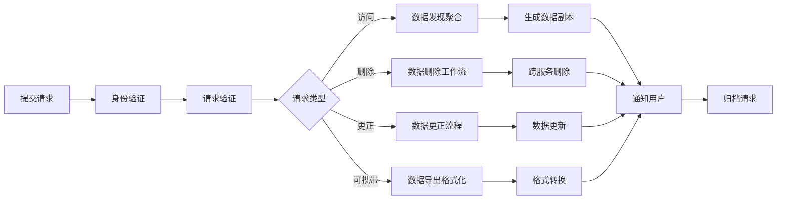

# REQ-00305：GDPR 数据主体权利请求自动化管理系统

- **编号**：REQ-00305
- **类别**：合规/隐私
- **优先级**：P1
- **状态**：new
- **涉及服务/模块**：user-service、gateway、admin-dashboard、backend/jobs、database/migrations、backend/shared/gdpr
- **创建时间**：2026-06-24 01:00 UTC
- **依赖需求**：REQ-00127（用户数据删除请求管理系统）

## 1. 背景与问题

根据欧盟《通用数据保护条例》(GDPR)，用户享有以下数据主体权利：
1. **访问权（第15条）**：用户有权获取其个人数据的副本
2. **更正权（第16条）**：用户有权要求更正不准确的数据
3. **删除权（第17条）**：用户有权要求删除其个人数据（"被遗忘权"）
4. **限制处理权（第18条）**：用户有权限制对其数据的处理
5. **数据可携带权（第20条）**：用户有权以结构化格式接收其数据
6. **反对权（第21条）**：用户有权反对基于合法利益的数据处理

当前系统缺少：
- 统一的数据主体请求(DSR)受理入口
- 自动化的请求验证和身份确认流程
- 跨服务数据发现和聚合机制
- 请求状态跟踪和时效监控
- 合规性报告和审计日志

## 2. 目标

构建完整的 GDPR 数据主体权利请求管理系统：
- 提供用户自助服务门户提交 DSR 请求
- 实现 30 天内响应的合规时限
- 自动化数据发现、聚合、导出、删除流程
- 提供完整的审计追踪和合规报告
- 支持 GDPR 合规证明的生成

## 3. 范围

- **包含**：
  - DSR 请求提交 API 和用户界面
  - 请求身份验证和授权机制
  - 跨服务数据发现引擎
  - 数据导出（JSON/CSV/PDF 格式）
  - 数据删除工作流（含第三方数据）
  - 请求状态跟踪和通知
  - 管理后台审核界面
  - 合规报告生成器
  - 审计日志存储

- **不包含**：
  - 其他地区隐私法规（CCPA、PIPL 等）
  - 数据分类和标记系统
  - 第三方数据处理协议管理

## 4. 详细需求

### 4.1 DSR 请求类型

```javascript
const DSRRequestType = {
  ACCESS: 'access',           // 访问权 - 数据副本
  RECTIFICATION: 'rectify',   // 更正权 - 数据更正
  ERASURE: 'erase',          // 删除权 - 数据删除
  RESTRICTION: 'restrict',    // 限制处理权
  PORTABILITY: 'port',        // 可携带权 - 数据导出
  OBJECTION: 'object'         // 反对权
};
```

### 4.2 API 设计

```
POST   /api/v1/gdpr/requests                    # 提交 DSR 请求
GET    /api/v1/gdpr/requests/:requestId         # 查询请求状态
GET    /api/v1/gdpr/requests/:requestId/download # 下载数据副本
PUT    /api/v1/gdpr/requests/:requestId/cancel  # 取消请求
GET    /api/v1/gdpr/requests                    # 用户请求历史
```

### 4.3 数据发现引擎

```javascript
// 跨服务数据发现
class DataDiscoveryEngine {
  async discoverUserData(userId) {
    const dataMap = {
      user: await userDiscovered(userId),
      pokemon: await pokemonDiscovered(userId),
      social: await socialDiscovered(userId),
      payment: await paymentDiscovered(userId),
      location: await locationDiscovered(userId),
      gym: await gymDiscovered(userId),
      reward: await rewardDiscovered(userId),
      catch: await catchDiscovered(userId)
    };
    return this.aggregateDataMap(dataMap);
  }
}
```

### 4.4 请求处理工作流



### 4.5 数据库 Schema

```sql
-- DSR 请求表
CREATE TABLE gdpr_requests (
  id UUID PRIMARY KEY DEFAULT gen_random_uuid(),
  user_id UUID NOT NULL REFERENCES users(id),
  request_type VARCHAR(20) NOT NULL,
  status VARCHAR(20) NOT NULL DEFAULT 'pending',
  submitted_at TIMESTAMP NOT NULL DEFAULT NOW(),
  verified_at TIMESTAMP,
  completed_at TIMESTAMP,
  deadline TIMESTAMP NOT NULL, -- 30 天期限
  data_scope JSONB,            -- 涉及的数据范围
  result_url TEXT,             -- 数据副本下载链接
  result_expires_at TIMESTAMP, -- 下载链接过期时间
  notes TEXT,
  created_at TIMESTAMP DEFAULT NOW(),
  updated_at TIMESTAMP DEFAULT NOW()
);

-- 请求处理日志
CREATE TABLE gdpr_request_logs (
  id UUID PRIMARY KEY DEFAULT gen_random_uuid(),
  request_id UUID NOT NULL REFERENCES gdpr_requests(id),
  action VARCHAR(50) NOT NULL,
  actor VARCHAR(100),          -- system/admin/user
  details JSONB,
  created_at TIMESTAMP DEFAULT NOW()
);

-- 数据发现记录
CREATE TABLE gdpr_data_discovery (
  id UUID PRIMARY KEY DEFAULT gen_random_uuid(),
  request_id UUID NOT NULL REFERENCES gdpr_requests(id),
  service_name VARCHAR(50) NOT NULL,
  table_name VARCHAR(100),
  record_count INTEGER,
  data_categories TEXT[],      -- PII、支付信息、位置数据等
  discovered_at TIMESTAMP DEFAULT NOW()
);
```

### 4.6 时限管理

- **标准时限**：30 天内响应（GDPR 要求）
- **复杂请求**：可延长至 90 天，需通知用户
- **时限告警**：第 7/14/21/28 天发送提醒
- **超时上报**：超时请求自动升级至管理员

### 4.7 安全要求

- 请求必须通过双重身份验证
- 数据副本下载链接 7 天后自动过期
- 敏感数据导出需管理员审核
- 删除操作需延迟执行（7 天犹豫期）

## 5. 验收标准（可测试）

- [ ] 用户可通过 API 或 UI 提交 6 种 DSR 请求
- [ ] 系统自动验证用户身份并创建请求记录
- [ ] 数据发现引擎能在 5 分钟内完成跨服务数据聚合
- [ ] 访问请求返回完整的 JSON 格式数据副本
- [ ] 可携带请求支持 JSON/CSV/PDF 三种导出格式
- [ ] 删除请求执行延迟 7 天，用户可取消
- [ ] 请求状态变更时自动发送通知（邮件/应用内）
- [ ] 管理后台可查看所有 DSR 请求及处理状态
- [ ] 系统自动计算并跟踪 30 天响应时限
- [ ] 审计日志记录所有请求操作和系统响应
- [ ] 合规报告可导出指定时间范围内的 DSR 处理统计

## 6. 工作量估算

**L** - 涉及跨服务协调、工作流引擎、合规性要求，预计 3-4 周

## 7. 优先级理由

P1 - GDPR 合规是欧盟市场准入的硬性要求，违规可能导致高达全球年营业额 4% 或 2000 万欧元的罚款。此需求直接影响项目的合规性和市场拓展能力。
